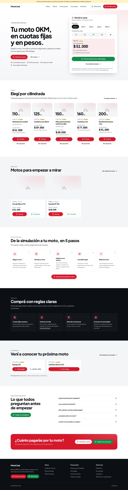
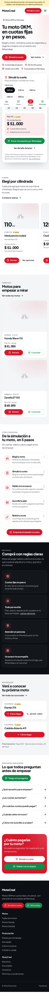

# MotoCred 2026 — auditoría, rediseño y modernización

Rediseño de **motocred.com.ar** como plataforma comercial de motos 0KM en cuotas, **sobre WordPress** y **conservando el logo actual**.

| | |
|---|---|
|  |  |

> Las capturas usan **valores de ejemplo** (entorno demo, marcados "A validar"). Ningún importe de este repositorio es un precio real.

## Contenido

| | |
|---|---|
| [docs/01-auditoria.md](docs/01-auditoria.md) | Auditoría de todas las páginas, **inconsistencias comerciales** con marcas [REQUIERE VALIDACIÓN] / [DATO A VALIDAR], SEO, UX, confianza |
| [docs/02-arquitectura.md](docs/02-arquitectura.md) | Menú, mapa del sitio, URLs, fuente única de datos, qué se conserva / cambia / elimina |
| [docs/03-sistema-visual.md](docs/03-sistema-visual.md) | Uso del logo, color, tipografía, componentes, fotografía y copywriting |
| [docs/04-wordpress.md](docs/04-wordpress.md) | Relevamiento técnico pendiente, por qué no migrar, shortcodes, **puesta en producción paso a paso** |
| [docs/05-medicion.md](docs/05-medicion.md) | Eventos GA4 / GTM / Meta Pixel y configuración |
| [docs/06-qa.md](docs/06-qa.md) | Qué se probó (y resultados) y qué hay que probar en staging |
| `wp-content/plugins/motocred-core/` | Plugin: planes, cuotas, motos, sucursales, entregas, simulador, WhatsApp con contexto, SEO, medición |
| `wp-content/themes/motocred-2026/` | Theme mobile-first |
| `tools/dev-setup.sh` · `tests/` | Entorno local y pruebas automatizadas |

## Lo esencial en 5 líneas

1. **Una sola fuente de datos**: cada cuota se carga una vez por plan y plazo; Home, Planes, Financiación, fichas, simulador, WhatsApp y páginas de suscripción (shortcode) la leen de ahí.
2. **Nada sin validar se publica**: el público ve "Consultá el valor"; el equipo logueado ve el dato con la etiqueta "A validar".
3. **El simulador está en todo el recorrido** (hero, header, barra inferior, cada plan y cada moto) y termina en un WhatsApp que ya dice plan, modelo, cuotas y valor.
4. **Condiciones según los T&C**: la web nueva no promete retiro "desde la primera cuota" hasta que MotoCred confirme esa condición (ver C1 en la auditoría).
5. **Nada existente se rompe**: formularios, pagos, suscripciones y URLs actuales se mantienen; las URLs viejas de catálogo redirigen con 301.

## Probar en local

```bash
WP_DIR=$PWD/.wp ./tools/dev-setup.sh      # WordPress + SQLite + datos de ejemplo
php -S 127.0.0.1:8080 -t .wp              # http://127.0.0.1:8080 · admin / admin
cd tests && npm i && npm run e2e && npm run admin
```

Requisitos: PHP ≥ 8.0 con `pdo_sqlite`, Composer, WP-CLI, Node ≥ 18.
